# A股市场雷达 Radar OS — 产品设计文档（开发版）

| 项目 | 内容 |
| --- | --- |
| 产品名称 | A股市场雷达 Radar OS |
| 文档版本 | V1.0 |
| 文档状态 | 评审稿（开发基线） |
| 编制日期 | 2026-08-10 |
| 上游文档 | 《A股市场雷达_Radar_OS_产品需求文档_PRD》V1.0 |
| 适用对象 | 前端 / 后端 / 算法 / 测试 / 产品研发团队 |
| 配套资源 | 已完成 UI 实现（Vue3 工程）、东方财富公开行情数据源接入（Netlify Functions 代理） |

---

## 1. 文档说明

### 1.1 文档目的

本文档在 PRD 基础上，对产品功能点进行**逐项完善与细化**，并补充 PRD 未覆盖的**逻辑调用链、数据口径、计算规则、接口契约、状态与异常处理、开发任务拆分**，作为整体项目开发、测试与验收的唯一技术基线。

本文档遵循以下原则：

1. **功能点全覆盖**：PRD 中 8 个核心功能 + 页面结构中的"个股追踪"全部展开为可开发的功能设计；
2. **逻辑调用清晰**：每个功能均给出「用户操作 → 前端组件 → Service → 接口代理 → 数据源 → 计算引擎 → 回显」的完整调用链；
3. **与现状对齐**：UI 设计与数据源选型已完成，本文档将现状固化为契约，后续开发在不破坏既有类型与组件的前提下增量实现；
4. **可验收**：每个功能给出验收要点，开发完成后可逐条核对。

### 1.2 阅读对象

| 角色 | 关注章节 |
| --- | --- |
| 产品 / 交互 | 第 2、4、8 章 |
| 前端开发 | 第 4、6、8、9 章 |
| 后端 / 算法 | 第 5、6、7、10 章 |
| 数据 / 采集 | 第 5、10 章 |
| 测试 | 第 8、11、13 章 |
| 项目负责人 | 第 3、12、13 章 |

### 1.3 术语表

| 术语 | 说明 |
| --- | --- |
| 市场脉冲指数 | 0-100 的市场综合评分，反映市场整体强弱 |
| 市场温度 | 涨跌家数、涨停/跌停、炸板等市场广度统计 |
| 市场情绪雷达 | 六维情绪因子雷达图 |
| 板块强度 | 板块综合评分（涨幅/成交额/资金流/涨停数加权） |
| 板块轮动地图 | TreeMap 形式展示板块资金规模与涨跌 |
| ETF 资金雷达 | 以 ETF 为观察窗口的资金流向监测 |
| 核心观察池 | 用户自选股票 / ETF / 板块集合 |
| AI 市场简报 | 每日自动生成的市场复盘文本 |
| 数据源代理 | Netlify Functions 中对上游行情 API 的转发与归一化层 |
| 降级链 | 数据不可用时的逐级兜底路径（东财 → 腾讯 → Mock） |

### 1.4 参考资料

1. 《A股市场雷达_Radar_OS_产品需求文档_PRD》V1.0；
2. 已完成前端工程 `radar-os-a-share-dashboard`（Vue3 + TypeScript + Vite + Element Plus + ECharts）；
3. 数据源接入实现：`netlify/functions/market-snapshot.mjs`、`netlify/functions/stock-search.mjs`；
4. 行业参考项目：全球股票行情表 v3（腾讯行情主源 + 东方财富备源经验）。

---

## 2. 产品概述

### 2.1 产品定位

**个人版金融数据驾驶舱**：面向个人投资者的智能市场分析 Dashboard，整合股票行情、市场情绪、板块资金、ETF 资金流向与 AI 分析能力，帮助用户在开盘前、盘中、收盘后快速判断市场状态、资金方向、热点机会与风险位置。

### 2.2 目标用户与使用场景

| 用户画像 | 核心诉求 | 使用时段 |
| --- | --- | --- |
| 短线 / 情绪交易者 | 快速判断赚钱效应、热点切换、涨停梯队 | 盘中实时、盘后复盘 |
| 中线趋势交易者 | 识别板块轮动、主力资金方向、ETF 趋势 | 盘后、收盘前 |
| 理财 / 观察型用户 | 低成本获取市场概览与 AI 解读 | 盘后、晨间 |

### 2.3 核心价值

1. **快速判断市场强弱**：市场脉冲指数一屏给出 0-100 综合评分；
2. **发现资金攻击方向**：板块资金流、ETF 资金雷达交叉验证；
3. **识别热点板块轮动**：板块强度榜 + 轮动地图；
4. **通过 ETF 观察机构资金趋势**：ETF 评分体系；
5. **AI 生成每日市场复盘**：状态、主线、风险、关注方向。

### 2.4 用户打开系统需要回答的 5 个问题

| 问题 | 对应功能 |
| --- | --- |
| 今天市场处于什么状态？ | 市场脉冲指数、市场温度、情绪雷达 |
| 当前资金流向哪里？ | 热点板块分析（资金流）、ETF 资金雷达 |
| 哪些板块正在增强？ | 板块强度评分、板块轮动地图 |
| 哪些 ETF 值得重点关注？ | ETF 资金雷达（评分排序） |
| 当前市场风险在哪里？ | 市场温度（炸板率、跌停）、AI 简报风险提示 |

### 2.5 设计原则

1. **一屏总览**：首页聚合所有核心指标，信息高密度；
2. **数字优先**：指标数值与涨跌色（A股惯例：红涨绿跌）直接呈现；
3. **交叉验证**：资金、价格、情绪多因子互相印证，降低单一指标误导；
4. **可扩展**：类型契约先行，Mock → 真实接口可无缝切换；
5. **合规底线**：仅做数据分析辅助，不提供涨跌预测与投资建议。

---

## 3. 系统总体架构

### 3.1 架构分层

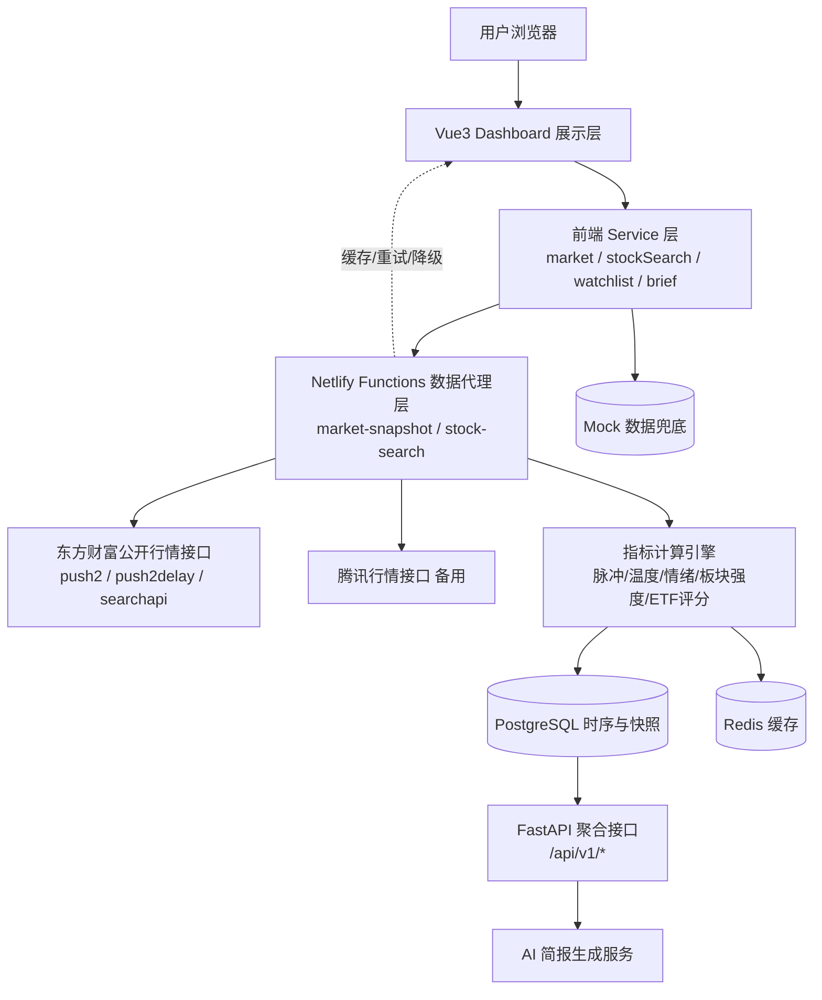

**分层说明**

| 层 | 职责 | 现状 | 目标 |
| --- | --- | --- | --- |
| 展示层 | 页面布局、图表渲染、交互 | ✅ 已完成（Vue3 + ECharts） | 保持 |
| 前端 Service 层 | 封装请求、类型校验、降级切换 | ✅ 基础版（market/stockSearch） | 扩展 watchlist/brief/sectors |
| 数据代理层 | 上游接口转发、字段归一化、超时重试 | ✅ 基础版（Netlify Functions） | 增加缓存、限流、多源切换 |
| 指标计算引擎 | 各类评分/指标计算 | ⏳ 前端 Mock 阶段 | 后端化（Python） |
| 数据存储 | 快照、历史序列、用户自选 | ⏳ 未开始 | PostgreSQL + Redis |
| 聚合 API | 面向前端 REST 接口 | ⏳ 未开始 | FastAPI |
| AI 简报 | 每日复盘生成 | ⏳ Mock | 规则引擎 + LLM |

### 3.2 技术选型（已定）

| 层级 | 技术 | 说明 |
| --- | --- | --- |
| 前端框架 | Vue 3 + TypeScript + Vite | 已落地 |
| UI 组件库 | Element Plus | 已落地 |
| 图表 | ECharts 5 | 已落地 |
| 前端部署 | Netlify（静态 + Functions） | 已落地 |
| 数据代理 | Netlify Functions（Node.js ESM） | 已落地 |
| 后端服务 | Python + FastAPI | 规划（MVP2） |
| 数据库 | PostgreSQL | 规划（MVP2） |
| 缓存 | Redis | 规划（MVP2） |
| 定时任务 | APScheduler / Celery Beat | 规划（MVP2） |
| AI 简报 | 规则模板引擎 → 可选 LLM API | 规划 |

### 3.3 模块划分

```text
radar-os-a-share-dashboard
├── src
│   ├── App.vue               # Dashboard 页面组合（顶栏/搜索/刷新/数据源状态）
│   ├── main.ts               # 应用入口（Element Plus 注册）
│   ├── styles.css            # 视觉系统与响应式
│   ├── data/mock.ts          # Mock 数据 + 类型契约（Sector/ETF/WatchItem/...）
│   ├── services/             # 前端数据服务
│   │   ├── market.ts         # 市场快照（东财实时，失败回退 Mock）
│   │   └── stockSearch.ts    # 个股搜索
│   └── components/
│       ├── ChartPanel.vue    # ECharts 生命周期封装（resize/销毁/更新）
│       └── SectionHeader.vue # 区块标题（eyebrow/title/caption/插槽）
└── netlify/functions/
    ├── market-snapshot.mjs   # 指数/广度/板块/ETF 聚合快照
    └── stock-search.mjs      # 东财 suggest + 实时报价
```

---

## 4. 信息架构与页面结构

### 4.1 页面地图

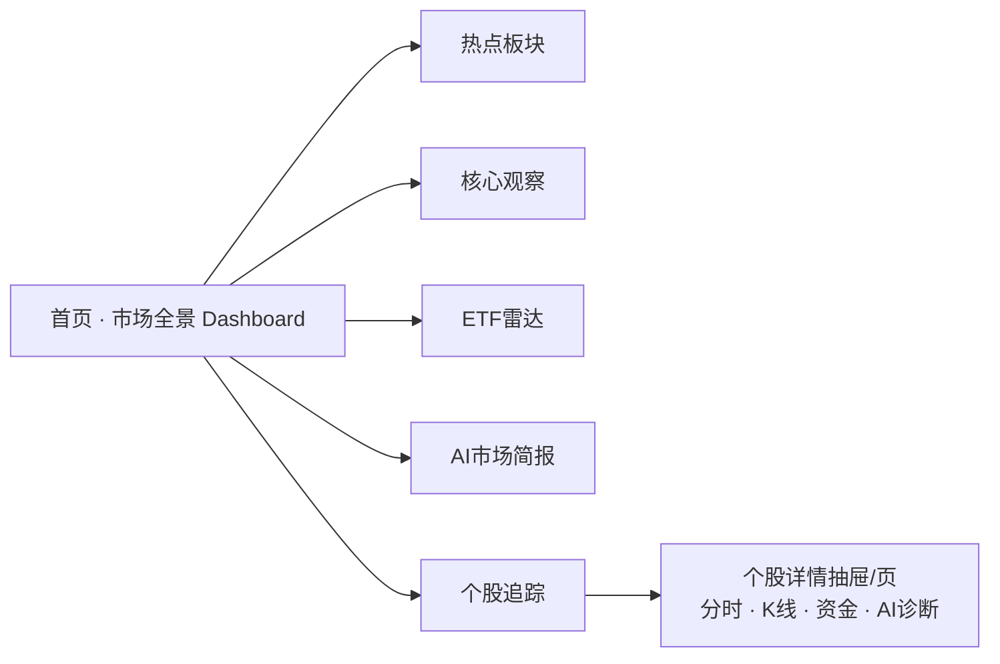

### 4.2 首页 Dashboard 布局（已实现，作为页面基线）

| 区块 | 编号 | 内容 | 数据来源 |
| --- | --- | --- | --- |
| 顶栏 | G0 | 品牌 / 主导航 / 市场状态 / 搜索 / 刷新 / 数据源标识 | — |
| Hero 市场脉冲 | 01 | 脉冲指数仪表盘（0-100）+ 核心指标网格（6 项） | 快照聚合 |
| 市场温度 | 02 | 上涨/下跌/平盘、涨停/跌停、炸板率 | 市场广度 |
| 市场情绪雷达 | 03 | 六维情绪因子雷达图 | 情绪计算 |
| 热点板块排行 | 04 | 板块涨幅横向条形图 + 当前聚焦 | 板块数据 |
| 板块轮动地图 | 05 | TreeMap（面积=资金规模，颜色=涨跌） | 板块数据 |
| ETF 资金雷达 | 06 | ETF 列表（价格/涨跌/成交额/资金流/信号） | ETF 数据 |
| 核心观察列表 | 07 | 自选股票/ETF 列表（搜索过滤/关注星标） | 观察池 |
| AI 市场简报 | 08 | 状态 / 摘要 / 行动建议 / 置信度 | AI 简报 |

### 4.3 导航与路由

- MVP1 为单页 Dashboard，主导航（市场全景 / 热点板块 / 核心观察 / ETF雷达 / AI市场简报 / 个股追踪）在当前为锚点定位或占位；
- 目标版本采用 Vue Router：
  - `/` 市场全景
  - `/sectors` 热点板块
  - `/watch` 核心观察
  - `/etf` ETF 雷达
  - `/brief` AI 市场简报
  - `/stock/:code` 个股追踪

### 4.4 全局交互元素

| 元素 | 行为 | 实现位置 |
| --- | --- | --- |
| 搜索框 | 输入关键词 → `stockSearch.searchStocks` → 下拉候选（股票/ETF/指数）→ 点击跳个股 | App.vue |
| 刷新按钮 | 触发市场快照重新拉取，更新 `lastUpdated` | App.vue |
| 时间范围切换 | 脉冲图 今日/本周/本月 切换 | App.vue `pulseRange` |
| 数据源标识 | 右上角显示当前数据源（东方财富 / Mock） | App.vue `dataSource` |
| 自动刷新 | 盘中 60s 轮询（规划） | 定时器（规划） |

---

## 5. 数据源设计

### 5.1 数据源选型结论（已定）

| 优先级 | 数据源 | 用途 | 接入方式 | 说明 |
| --- | --- | --- | --- | --- |
| P0 | 腾讯财经免费接口 | 指数/ETF/个股报价（价格/涨跌/成交额）、沪深涨跌家数、行业板块排行与主力资金流、个股/ETF/指数搜索 | Netlify Functions 转发：`qt.gtimg.cn`（GBK）、`smartbox.gtimg.cn`、`proxy.finance.qq.com getRank` | 行情稳定准确、不易封 IP，**全部数据域优先采用腾讯** |
| P1 | 东方财富免费接口 | 涨停/跌停/炸板池（腾讯无等价免费接口）；腾讯失败时的指数涨跌家数/板块/ETF/搜索备用 | Netlify Functions 转发（push2 / searchapi / push2ex） | 字段丰富，补齐腾讯未覆盖的打板数据 |
| P2 | Mock 数据 | 本地开发 / 接口不可用兜底 | `src/data/mock.ts` | 保证 UI 正常展示 |

> 注意：免费接口无 SLA、高频请求可能被限流、字段可能变动，须按"降级链 + 超时 + 重试 + 兜底"实现。

### 5.2 数据源接口清单（腾讯主 / 东财备）

**腾讯财经（主数据源）**

| 接口 | 地址 | 必填参数 | 主要字段 | 用途 |
| --- | --- | --- | --- | --- |
| 批量报价 | `qt.gtimg.cn/q=sh000001,sz159995,...` | 证券代码（市场前缀+6位，逗号分隔） | GBK、`~` 分隔：f1名称/f2代码/f3最新价/f31涨跌/f32涨跌幅%/f36成交量(手)/f37成交额(万元) | 指数 / ETF / 个股实时报价与两市成交额 |
| 涨跌家数 | `qt.gtimg.cn/q=bkqtRank_A_sh,bkqtRank_A_sz` | 固定 | `v_bkqtRank_A_sh/sz`：f2涨/f3平/f4跌/f5总数 | 沪深两市涨跌家数（沪+深合计） |
| 板块排行 | `proxy.finance.qq.com/cgi/cgi-bin/rank/pt/getRank` | `board_type=hy/gn`、`sort_type=priceRatio`、`direct`、`offset`、`count` | `data.rank_list[]`：name/zdf涨跌幅/turnover成交额(万元)/zljlr主力净流入(万元)/lzg领涨股/hsl换手率/zgb板块内涨跌家数 | 行业 / 概念板块涨幅榜与资金流 |
| 联想搜索 | `smartbox.gtimg.cn/s3/?v=2&q=...&t=all` | `q` 关键字 | `v_hint="sh~600519~贵州茅台~gzmt~GP-A^..."`，`^` 分隔多条 | 个股 / ETF / 指数联想搜索 |

**东方财富（备用 / 补齐）**

| 接口 | 地址 | 必填参数 | 主要字段 | 用途 |
| --- | --- | --- | --- | --- |
| 涨停股池 | `push2ex.eastmoney.com/getTopicZTPool` | `dpt=wz.ztzt`、`sort=fbt:asc`、`date=YYYYMMDD` | `data.pool[]` 长度 | 涨停家数 |
| 跌停股池 | `push2ex.eastmoney.com/getTopicDTPool` | `dpt=wz.ztzt`、`sort=fund:asc`、`date=YYYYMMDD` | `data.pool[]` 长度 | 跌停家数 |
| 炸板股池 | `push2ex.eastmoney.com/getTopicZBPool` | `dpt=wz.ztzt`、`sort=fbt:asc`、`date=YYYYMMDD` | `data.pool[]` 长度 | 炸板家数 |
| 行情列表（备） | `push2.eastmoney.com/api/qt/ulist.np/get` | `secids`（市场.代码）、`fields` | `data.diff[]`：f2价格/f3涨跌幅/f12代码/f14名称/f104涨家/f105跌家/f106平盘 | 腾讯失败时的指数/ETF/涨跌家数备用 |
| 板块列表（备） | `push2.eastmoney.com/api/qt/clist/get` | `fs=m:90+t:2`（行业板块）、`fid=f3`、`fields=f2,f3,f4,f12,f14,f62` | `data.diff[]`：f62 主力净流入 | 腾讯失败时的板块备用 |
| 个股搜索（备） | `searchapi.eastmoney.com/api/suggest/get` | `input`、`type=14`、`count` | `QuotationCodeTable.Data[]`：Code/Name/QuoteID/Classify/MktNum | 腾讯失败时的搜索备用 |

> 说明：涨停/跌停/炸板池为东财独有数据（腾讯免费接口无对应），始终标注 `domains.pools = "eastmoney"`。

**字段映射（腾讯 → 内部模型）**

| 腾讯字段 | 含义 | 内部模型字段 |
| --- | --- | --- |
| 报价 f3 / f32 / f37 | 最新价 / 涨跌幅% / 成交额(万元) | `price` / `change` / `amount`（亿） |
| bkqtRank f2 / f3 / f4 | 涨 / 平 / 跌家数 | `breadth.up / flat / down` |
| getRank zdf / turnover / zljlr | 板块涨跌幅% / 成交额(万元) / 主力净流入(万元) | `change` / `amountYi` / `flowYi` |
| getRank lzg / hsl / zgb | 领涨股 / 换手率 / 板块内涨跌家数 | `leader` / `heat` 参考 / 板块宽度 |
| smartbox market~code~name~type | 市场 / 代码 / 名称 / 类型 | `market` / `code` / `name` / `type` |

### 5.3 采集频率与缓存策略

| 场景 | 刷新频率 | 缓存 TTL |
| --- | --- | --- |
| 盘中（09:15-15:00 交易时段） | 60s 自动轮询 + 手动刷新 | 30s（CDN + 函数级） |
| 盘后 / 非交易时段 | 收盘快照，不轮询 | 5min |
| 搜索建议 | 用户输入即时 | 20s |
| 指标计算 / AI 简报 | 收盘后 15:10 定时生成 | 当日快照长期保留 |

> 时间判定：按 `Asia/Shanghai` 时区；`09:15 ≤ t < 15:00` 视为盘中；周末/节假日按非交易处理。

### 5.4 限流与降级策略

1. **代理层缓存**：同参请求命中缓存直接返回，降低上游压力；
2. **重试**：单次请求 8s 超时，失败重试 1 次；
3. **数据源切换**：每域独立降级——优先腾讯，失败降级东财，全部失败返回 502，前端自动切入 Mock（涨停/跌停/炸板池仅东财）。
4. **局部降级**：指数失败不影响板块/ETF 展示，`warnings[]` 上报各失败域；
5. **节流**：前端轮询使用 60s 间隔；搜索使用 300ms debounce。

### 5.5 前端降级调用链

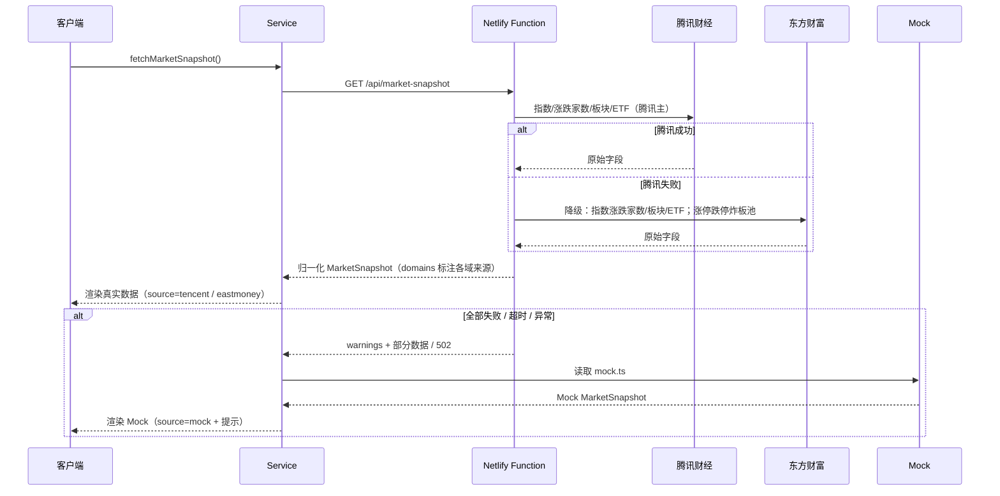

---

## 6. 数据模型与接口契约

### 6.1 核心类型定义（TypeScript，与 mock.ts 保持一致）

```ts
// ===== 市场快照 =====
export interface MarketSnapshot {
  source: 'eastmoney' | 'tencent' | 'mock'   // 当前数据源
  fetchedAt: string                          // ISO 时间
  market: {
    breadth: { up: number; down: number; flat: number }
    indices: Array<{ code: string; name: string; price: number; change: number }>
    limitUp: number; limitDown: number; brokenBoard: number  // 规划字段
    turnover: number;                         // 两市成交额（亿）
  }
  sectors: Sector[]
  etfs: Array<ETF & { flow: string | null }>
  warnings?: string[]                         // 各数据域异常提示
}

// ===== 板块 =====
export interface Sector {
  name: string
  change: number      // 涨跌幅 %
  amount: string      // 成交额/净流入（展示字符串）
  leader: string      // 领涨股/代码
  heat: number        // 热度 0-100
  trend: 'up' | 'down' | 'flat'
  score?: number      // 板块强度评分（计算字段）
  limitUpCount?: number // 涨停数（计算字段）
}

// ===== ETF =====
export interface ETF {
  code: string
  name: string
  price: string
  change: number
  amount: string
  flow: string
  signal: string      // 雷达信号：强势放量/资金抢筹/趋势增强/高位换手/宽幅震荡...
  score?: number      // ETF 综合评分（计算字段）
}

// ===== 观察池 =====
export interface WatchItem {
  code: string
  name: string
  type: '股票' | 'ETF' | '板块'
  price: string
  change: number
  flow: string
  status: string      // 主升浪/趋势向上/资金共振/观察...
  starred: boolean
}

// ===== AI 简报 =====
export interface AiBrief {
  status: string       // 市场状态标签，如「震荡轮动 · 等待聚焦」
  summary: string      // 一段话摘要
  actions: string[]    // 行动建议（1-3 条）
  riskTips: string[]   // 风险提示（规划字段）
  confidence: number   // 置信度 0-100
  generatedAt: string
  metrics: { pulse: number; emotion: number; breadthScore: number }  // 生成依据（规划）
}

// ===== 脉冲时序 =====
export interface PulsePoint { t: string; score: number }
export interface PulseSeries {
  today: PulsePoint[]    // 今日分时采样
  week: PulsePoint[]     // 本周日度
  month: PulsePoint[]    // 本月日度
}
```

### 6.2 前端 Service API

| 方法 | 签名 | 说明 |
| --- | --- | --- |
| `fetchMarketSnapshot()` | `() => Promise<MarketSnapshot>` | 市场聚合快照，失败回退 Mock |
| `searchStocks(query)` | `(q: string) => Promise<StockSearchResult[]>` | 个股/ETF/指数搜索 |
| `fetchPulse(range)` | `(r: 'today'\|'week'\|'month') => Promise<PulseSeries>` | 脉冲时序（规划） |
| `fetchSectorDetail(code)` | `(code: string) => Promise<SectorDetail>` | 板块详情（规划） |
| `fetchEtfDetail(code)` | `(code: string) => Promise<EtfDetail>` | ETF 详情（规划） |
| `getWatchlist() / addWatch() / removeWatch()` | 观察池 CRUD | localStorage（MVP）/ 服务端（后端） |
| `fetchAiBrief(date)` | `(date?: string) => Promise<AiBrief>` | AI 简报（规划） |

### 6.3 代理层 API（Netlify Functions）

| 端点 | 入参 | 出参 | 错误 |
| --- | --- | --- | --- |
| `GET /api/market-snapshot` | 无 | `MarketSnapshot`（source=eastmoney） | 502 + warnings |
| `GET /api/stock-search?q=` | `q` 关键词 | `{ source, query, results: StockSearchResult[] }` | 502 + `{error, results:[]}` |
| `GET /api/pulse?range=` | 范围 | 脉冲时序（规划） | 502 |
| `GET /api/sectors/detail?code=` | 板块代码 | 板块详情（规划） | 502 |
| `GET /api/etf/detail?code=` | ETF 代码 | ETF 详情（规划） | 502 |

### 6.4 后端 REST API（规划，FastAPI）

| 端点 | 方法 | 说明 |
| --- | --- | --- |
| `/api/v1/market/snapshot` | GET | 聚合快照（读 Redis，未命中查库/上游） |
| `/api/v1/market/pulse?range=` | GET | 脉冲历史序列 |
| `/api/v1/sectors/rank?sort=score` | GET | 板块强度榜 |
| `/api/v1/sectors/{code}/detail` | GET | 板块成分与资金 |
| `/api/v1/etfs/rank` | GET | ETF 评分榜 |
| `/api/v1/watchlist` | GET/POST/DELETE | 用户自选（需鉴权，规划） |
| `/api/v1/brief?date=` | GET | AI 简报 |
| `/api/v1/health` | GET | 健康检查 |

---

## 7. 核心算法与指标计算设计

> 约定：所有指标计算以收盘后为准可复算；盘中为实时估算。A股颜色约定：**红涨绿跌**（与 PRD 一致）。

### 7.1 市场脉冲指数（0-100）

**目标**：用单一分数概括市场强弱，附带五档状态。

**输入指标与权重（PRD）**

| 指标 | 权重 | 原始数据 | 说明 |
| --- | --- | --- | --- |
| 涨跌比例 | 25% | 上涨家数 / 总家数 | 市场广度 |
| 涨停数量 | 20% | 涨停家数 | 情绪强度 |
| 主力资金 | 20% | 全市场主力净流入 | 资金方向 |
| 成交量 | 15% | 两市成交额（较 5 日均量） | 活跃度 |
| 热点强度 | 10% | 涨停板块集中度 / 连板高度 | 主线强度 |
| 市场波动 | 10% | 指数振幅 / 波动率 | 风险水平 |

**计算步骤**

1. **标准化**：每个子指标按当日历史分布映射到 0-100：
   - `s_i = clamp((x_i - min_i) / (max_i - min_i) × 100, 0, 100)`
   - 边界 `min/max` 取近 60 个交易日的 5%/95% 分位（离线标定，配置化）；
   - 波动项取反向映射（波动越大分数越低，体现风险）。
2. **加权合成**：`pulse = Σ w_i × s_i`
3. **状态分级（PRD）**

| 区间 | 状态 | 颜色 |
| --- | --- | --- |
| 0-25 | 冰点 | 深灰/蓝 |
| 25-50 | 偏弱 | 蓝 |
| 50-70 | 震荡 | 黄/橙 |
| 70-90 | 强势 | 红 |
| 90-100 | 高热度 | 深红 |

4. **时序采样**：今日按 30min 采样（约 12 点）；本周按日；本月按日（近 20 交易日）。

**Mock 对照**：当前 `pulseSeries` 数组（今日/本周/本月各 12 点）即为该算法的静态样本。

### 7.2 市场温度（广度统计）

**展示字段与口径**

| 字段 | 口径 | 数据源字段 |
| --- | --- | --- |
| 上涨 / 下跌 / 平盘 | 全 A 当日涨跌平家数 | 东财 f104/f105/f106（或涨跌分布接口） |
| 涨停 / 跌停 | 收盘价达涨/跌停幅度的家数 | 涨跌分布接口 |
| 炸板数量 / 炸板率 | 曾涨停后打开的家数；`炸板率 = 炸板 / (涨停+炸板)` | 涨停池数据（规划） |
| 两市成交额 | 沪+深成交额合计 | f6 聚合 |

**涨跌家数逻辑**
1. 优先使用指数快照中的 f104/f105/f106（当前已实现）；
2. 增强方案：调用涨跌分布接口得到区间分布，换算全市场家数；
3. 校验：`up + down + flat ≈ 全A总数`，偏差 > 5% 时标记数据异常。

### 7.3 市场情绪雷达（六维因子）

**六个维度（与已实现 radar 一致）**

| 维度 | 计算口径 | 满分含义 |
| --- | --- | --- |
| 赚钱效应 | 上涨家数占比 + 平均涨幅 | 多数上涨且普涨 |
| 资金活跃 | 两市成交额 / 近 5 日均额 | 放量 |
| 热点强度 | 涨停家数 + 最高连板高度 | 接力顺畅 |
| 连板高度 | 最高连板数（如 4 板=70） | 高度打开 |
| 市场宽度 | 上涨家数占比（去权重） | 普涨 |
| 风险偏好 | 炸板率反向 + 跌停家数反向 | 无恐慌 |

**合成**：六维均值 `emotion = mean(v1..v6)`，标签映射：`<30 恐慌 / 30-50 偏弱 / 50-70 中性 / >70 偏强`（当前 Mock 54.5 = 中性偏强）。

**置信度**：`confidence = 100 - Σ(缺失因子数 × 15)`，任一因子缺失扣 15 分，下限 40。

### 7.4 板块强度评分（PRD 权重）

```
板块强度 score = 涨幅分×30% + 成交额分×20% + 资金流分×30% + 涨停数分×20%
```

- 各分项先做 **当日板块间归一化**（min-max，0-100）；
- 资金流取主力净流入（东财 f62，单位元，需换算为亿展示）；
- `heat`（热度）= 强度评分与涨幅的复合热度，供排序展示。

**排序**：默认按 `score` 降序；支持按涨幅/成交额/资金流切换排序（规划）。

### 7.5 板块轮动地图（TreeMap）

| 视觉维度 | 数据映射 | 规则 |
| --- | --- | --- |
| 面积 | 资金规模（成交额/净流入绝对值） | `value` 字段，越大块越大 |
| 颜色 | 涨跌 | 涨幅 ≥0 蓝色系 / <0 红色系，透明度随 |涨跌幅| 增强 |
| 标签 | 板块名 | 名称 + 涨跌幅 tooltip |

**轮动判定（增强，规划）**：对板块近 5 日强度排名做滑动窗口，输出「持续走强 / 新晋热点 / 退潮 / 反复」四类标签，供热点板块排行标注。

### 7.6 ETF 资金雷达评分（PRD 权重）

```
ETF评分 score = 价格趋势分×30% + 资金流分×30% + 成交活跃分×20% + 板块强度分×20%
```

| 分项 | 口径 | 数据源 |
| --- | --- | --- |
| 价格趋势 | 近 5 日涨跌幅 / 均线斜率 | 行情历史（规划） |
| 资金流 | ETF 份额变化 × 净值 或 成交额占比 | 份额数据（规划） |
| 成交活跃 | 当日成交额 / 近 5 日均额 | f6 |
| 板块强度 | 所属行业板块强度评分 | 板块计算 |

**雷达信号规则（与已实现 signal 一致）**

| 条件 | 信号 |
| --- | --- |
| 涨幅 ≥ 3% 且放量 | 强势放量 |
| 资金净流入且涨幅 > 0 | 资金抢筹 |
| 资金净流入且涨幅 0-3% | 趋势增强 |
| 换手/成交异常放大 | 高位换手 |
| 涨幅 < 0 或净流出 | 宽幅震荡 / 资金流出 |

### 7.7 AI 市场简报

**生成时机**：交易日收盘后（15:10）定时生成；可手动重新生成。

**内容结构（PRD）**

1. 市场状态（脉冲指数 + 情绪标签）；
2. 当前主线（板块强度 TOP1-3 + 资金流交叉验证）；
3. 风险提示（炸板率升高 / 跌停增加 / 高位放量滞涨）；
4. 关注方向（板块/ETF 候选，仅客观描述）。

**生成方式（两阶段）**
- **规则引擎（先落地）**：基于指标模板填充句子，输出结构稳定、可解释；
- **LLM 增强（后接入）**：将指标 JSON 作为上下文，约束「不预测涨跌、不构成建议」，输出后校验合规词表。

**合规约束（硬性）**
- 禁止出现"买入/卖出/目标价/预测上涨"等表述；
- 页面固定展示「仅供研究参考，不构成投资建议」。

---

## 8. 功能详细设计与逻辑调用

> 本章为开发核心依据。每个功能给出「调用链时序图 + 调用链步骤表 + 状态/异常 + 验收要点」。调用链命名统一：`组件 → Service → 代理 → 上游`。

### 8.1 市场全景首页（聚合页）

**功能概述**：首页聚合 01-08 全部模块，一次拉取市场快照即可渲染，保证首屏一致性与性能。

**逻辑调用链**

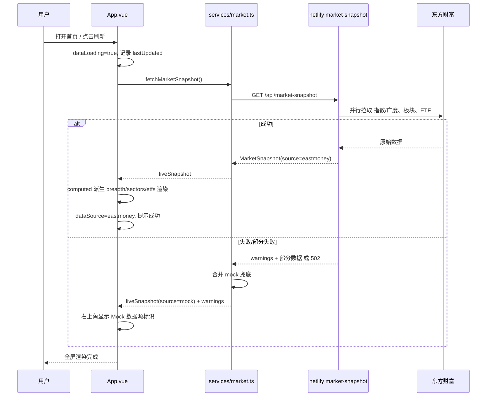

**调用链步骤表**

| 步骤 | 动作 | 函数/接口 | 关键字段 |
| --- | --- | --- | --- |
| 1 | 页面挂载触发快照拉取 | `onMounted → fetchMarketSnapshot()` | — |
| 2 | 代理层并行请求上游 | `market-snapshot.mjs handler()` | indices / sectors / etfs 三段 try-catch |
| 3 | 上游返回原始字段 | 东财 ulist / clist | f2,f3,f4,f12,f14,f62,f104-106 |
| 4 | 归一化为内部模型 | `number()/amount()` 格式化 | price/change/amount/flow |
| 5 | 前端接收并派生展示数据 | `computed: currentBreadth/displaySectors/displayEtfs` | breadth/sectors/etfs |
| 6 | 失败时兜底 | `catch → mock` | source=mock |

**状态与异常**

| 状态 | 表现 |
| --- | --- |
| 加载中 | `dataLoading=true`，刷新按钮 loading |
| 东财成功 | 数据源标识「东方财富」，页脚显示真实时间 |
| 部分失败 | warnings 展示在页脚/提示条，缺省模块用 Mock 填充 |
| 全失败 | 全部回退 Mock，标识「Mock 数据演示」 |
| 非交易时段 | 使用收盘快照，禁止高频轮询 |

**验收要点**
1. 打开页面 3s 内首屏可见；
2. 刷新后 8 个模块数据一致（同一快照）；
3. 断网/关闭代理时自动切换 Mock 且无白屏；
4. 页脚正确显示数据锚点与免责声明。

---

### 8.2 市场脉冲指数

**功能概述**：展示 0-100 综合评分仪表盘 + 今日/本周/本月时序曲线。

**业务规则**
- 五档状态分级（0-25 冰点 / 25-50 偏弱 / 50-70 震荡 / 70-90 强势 / 90-100 高热度）；
- 时间范围切换：今日（12 个 30min 采样点）/ 本周（5 交易日）/ 本月（近 20 交易日）；
- 仪表盘指针 + 数字 + 状态标签联动。

**逻辑调用链**

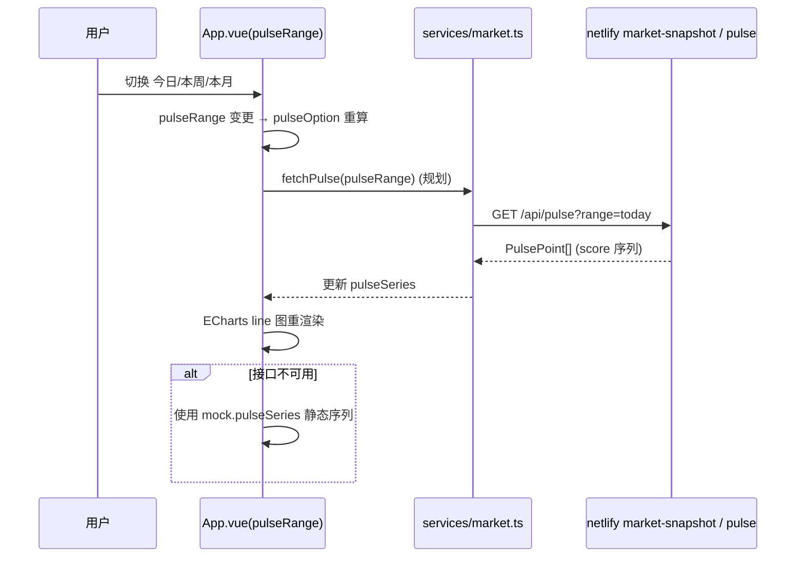

**计算来源（MVP 阶段）**：pulse 分数由服务端指标计算引擎产出（第 7.1 节）；当前前端使用 Mock 序列占位，接口就绪后无缝替换。

**状态与异常**
- 空序列：显示「暂无数据」，不渲染 0 点曲线；
- 分数缺失：按 `0-100` 之外的值过滤并告警。

**验收要点**
1. 三档时间范围切换图表正常且标签正确；
2. 仪表盘指针/数字/状态标签三者一致；
3. 数据源为真实时，数值与后端计算结果一致（±0.1）。

---

### 8.3 市场温度

**功能概述**：展示上涨/下跌/平盘、涨停/跌停、炸板率、两市成交额等广度指标。

**逻辑调用链**

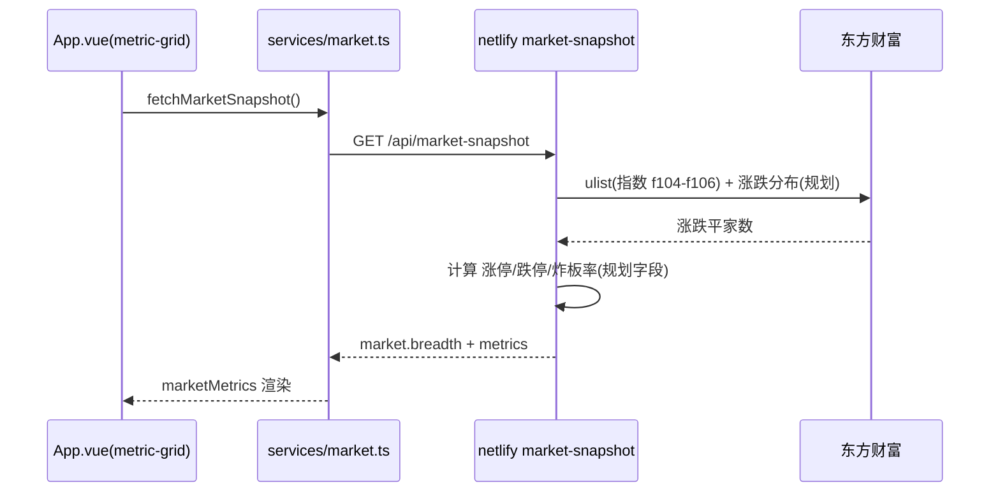

**指标卡片规则（已实现 6 卡）**

| 卡片 | 值 | 增量/口径 | 涨跌色 |
| --- | --- | --- | --- |
| 上涨/下跌 | `2,517 / 2,566` | 差值 | 下跌为负→绿 |
| 涨停/跌停 | `68 / 14` | 较昨日 ± | 涨停增加→红 |
| 两市成交额 | `1.18 万亿` | 较昨日 % | 放量→红 |
| 炸板率 | `28.6%` | 较昨日 % | 升高→绿(风险) |
| 热点集中度 | `72.4` | 较昨日 | — |
| 北向资金 | `+42.6 亿` | 净流入 | 流入→红 |

> 注意：A股红涨绿跌，风险类指标（炸板率升高）按「风险上升=绿」表达，需在 UI 注释保持一致。

**验收要点**
1. 六卡数值与快照一致，增量 delta 正确；
2. 涨跌家数相加约等于全A总数；
3. 无数据时卡片显示「--」。

---

### 8.4 市场情绪雷达

**功能概述**：六维情绪因子雷达图 + 置信度标签。

**逻辑调用链**

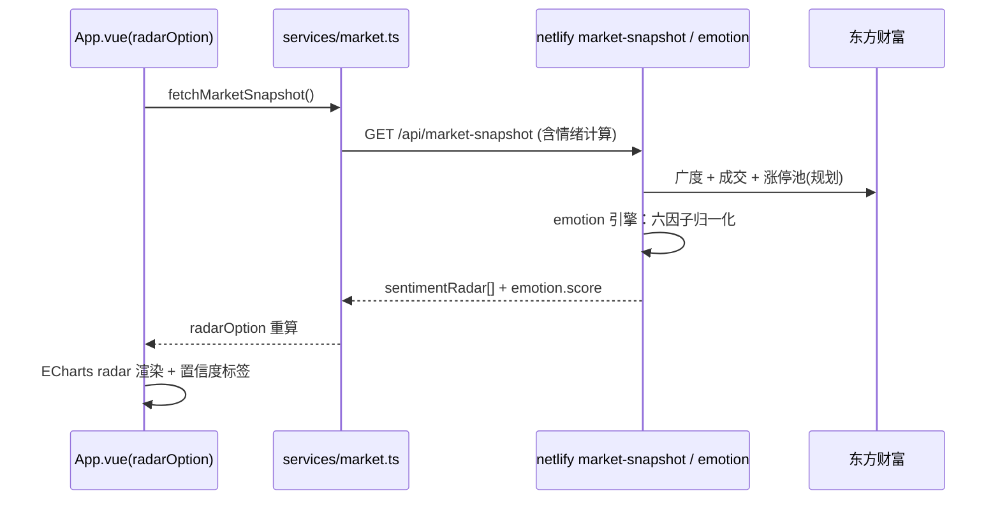

**展示规则**
- 六维：赚钱效应 / 资金活跃 / 热点强度 / 连板高度 / 市场宽度 / 风险偏好；
- 置信度：`confidence = 100 - 缺失因子数×15`，低于 40 显示「低置信」；
- 图例：「偏强因子」蓝点 /「待确认因子」浅点（已实现）。

**验收要点**
1. 六维值域 0-100，雷达图闭合；
2. 任一因子缺失时置信度正确扣减；
3. 情绪标签与分数区间映射一致。

---

### 8.5 热点板块分析

**功能概述**：板块强度榜（涨幅 × 成交额 × 资金流 × 涨停数），横向条形图 + 当前聚焦板块。

**逻辑调用链**

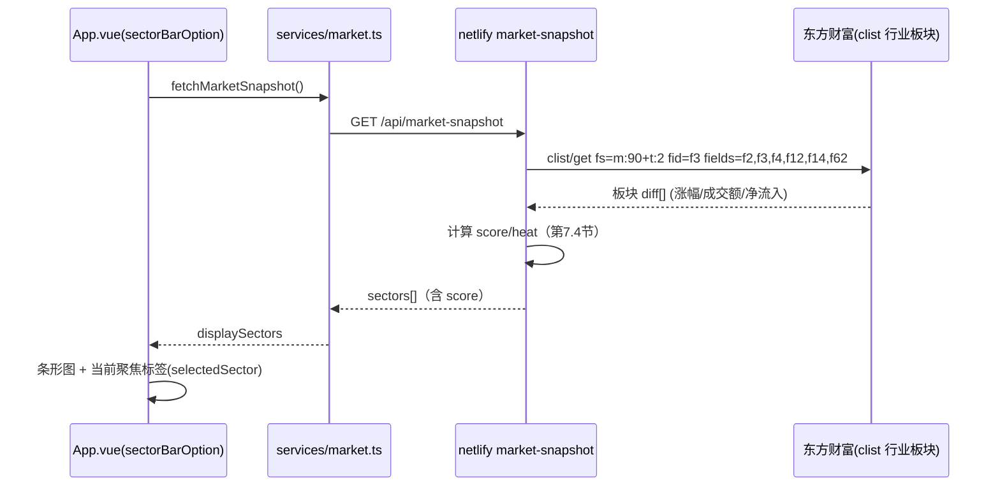

**业务规则**
- 默认按涨幅取前 N（当前 8 条，可配置）；
- `当前聚焦` = 综合 score 最高板块，标注「资金共振」；
- tooltip 展示板块涨跌 + 净流入（已实现）；
- 板块数据中 `leader` 字段当前映射为板块代码，后续改为领涨股名称。

**验收要点**
1. 榜单按规则排序，条形长度与涨幅/评分一致；
2. 资金净流入单位统一（亿），正负号正确；
3. 点击板块行可跳转板块详情（规划交互）。

---

### 8.6 板块轮动地图

**功能概述**：TreeMap 呈现板块资金规模（面积）与涨跌（颜色）。

**逻辑调用链**

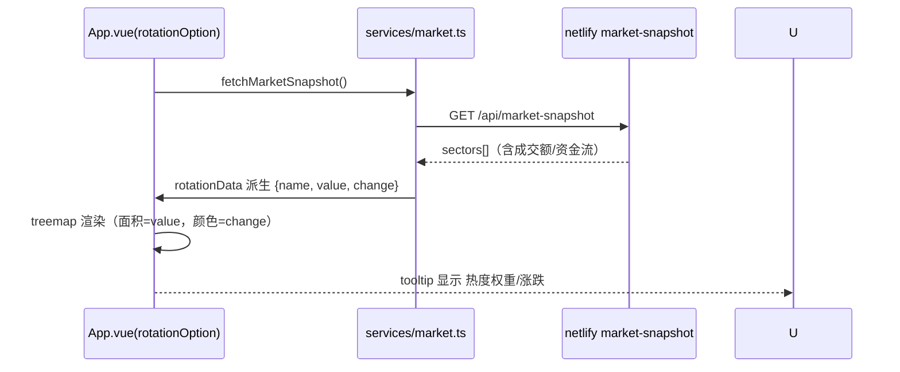

**数据映射规则**
- `value` = 资金规模（净流入绝对值，取整）；
- `color`：涨 → 蓝（透明度随涨幅增强），跌 → 红（透明度随跌幅增强）；
- 无资金数据时退化为按成交额排序。

**验收要点**
1. 面积大小与资金规模单调一致；
2. 颜色正负与透明度正确；
3. 浏览器缩放不溢出、可完整显示。

---

### 8.7 ETF 资金雷达

**功能概述**：ETF 列表（名称/代码/最新价/涨跌幅/成交额/资金净流入/雷达信号），观察机构资金方向。

**逻辑调用链**

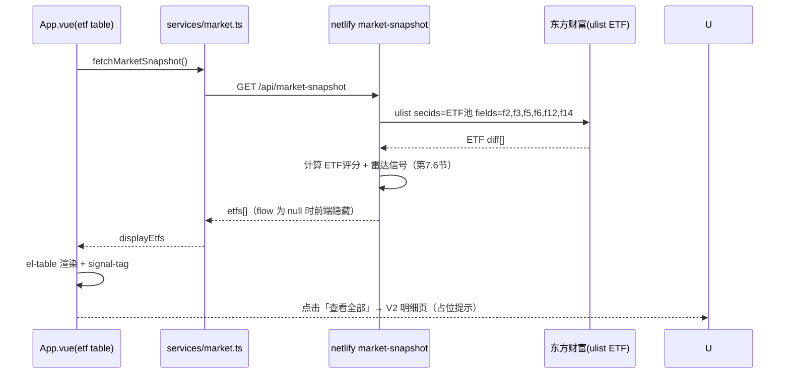

**ETF 池管理（规划）**
- 内置默认池：科创50(588000)、芯片(159995)、人工智能(159819)、半导体(512480)、沪深300(510300) 等；
- 支持用户自定义 ETF 池（V2）。

**字段规则**
- `flow` 当前上游暂缺份额/净申购数据，显示 `null` → 表格显示「--」，信号按涨幅+成交额推断（已实现）；
- 评分列默认隐藏，V2 开放排序。

**验收要点**
1. ETF 列表按涨跌幅/评分排序，信号标签与规则一致；
2. 资金流缺失时优雅显示「--」；
3. 行点击可跳 ETF 详情（规划）。

---

### 8.8 核心观察股票池

**功能概述**：用户自选股票/ETF 列表，支持搜索过滤、星标关注、状态标签。

**逻辑调用链**

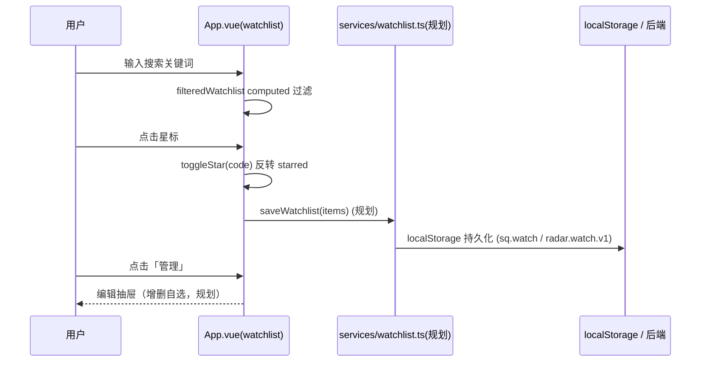

**业务规则**
- 过滤：名称或代码包含关键词（不区分大小写）；
- 星标：本地即时反馈 + 持久化；
- 类型：股票 / ETF（后续支持板块）；
- 状态标签：主升浪 / 趋势向上 / 资金共振 / 观察 / 加速 等，由服务端状态机产出（规划）；
- 默认池：寒武纪-U、北方华创、卓胜微、科创50ETF、芯片ETF（当前 Mock）。

**数据来源（规划）**
- MVP1：localStorage（`radar.watch.v1`）与 Mock 融合；
- MVP2：POST /api/v1/watchlist 服务端存储（按用户）。

**验收要点**
1. 搜索即时过滤、无结果时显示空态；
2. 星标状态刷新后保留；
3. 价格/涨跌/资金流来自快照，缺失显示「--」。

---

### 8.9 AI 市场简报

**功能概述**：每日生成市场状态、主线、风险、关注方向的结构化简报，支持展开/收起。

**逻辑调用链**

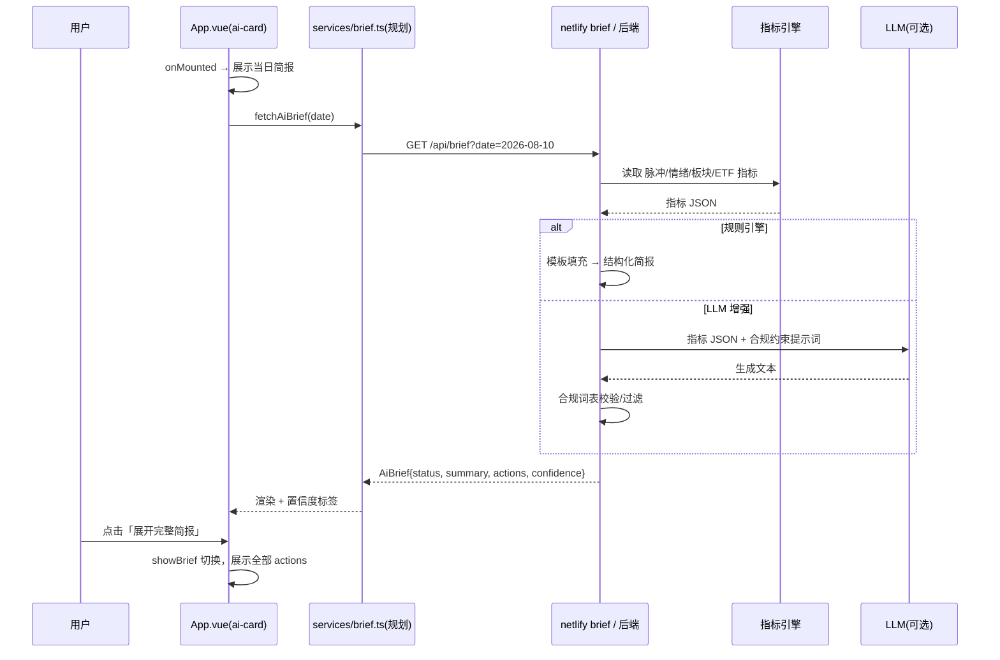

**内容规则（PRD 硬性约束）**
- 禁止预测股票涨跌、禁止给出买卖建议；
- 必须包含：市场状态、当前主线、风险提示、关注方向；
- 每条建议前带序号 `01/02/03`；
- 底部固定免责声明。

**状态与异常**
- 非交易日：显示最近一个交易日的简报并标注日期；
- 生成失败：展示上次成功简报 + 「生成失败，重试」按钮；
- 低置信（<40）：简报顶部提示「数据不完整，仅供参考」。

**验收要点**
1. 简报四要素齐全，无违禁词；
2. 展开/收起交互正常；
3. 置信度与数据完整性联动。

---

### 8.10 个股追踪 / 搜索

**功能概述**：通过全局搜索定位股票/ETF/指数，进入个股追踪页查看实时行情与资金。

**逻辑调用链**

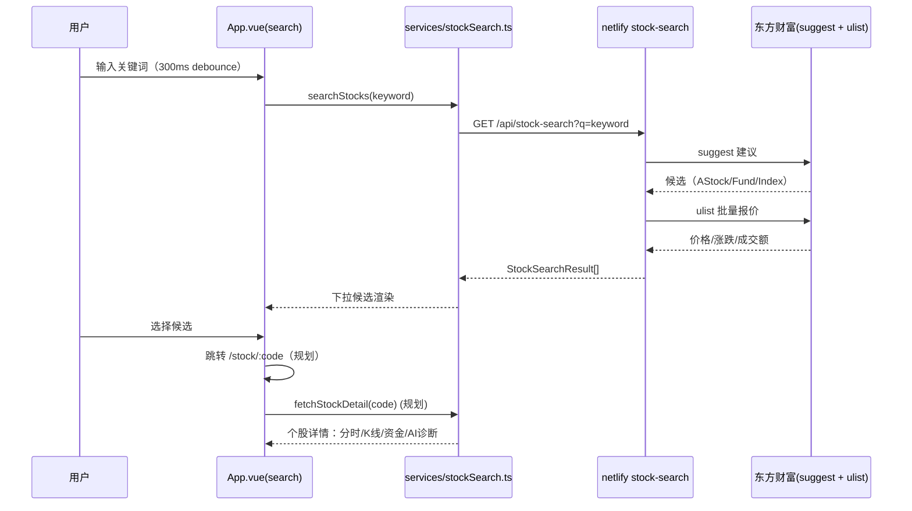

**业务规则**
- 候选类型过滤：A股、基金（ETF）、指数；
- 搜索为空：返回空数组，不调用上游；
- 上游失败：返回空数组 + 提示「搜索暂不可用」；
- 个股详情（V2）：分时双图、K线、主力净流入、AI 诊断（参考行业项目 v3 经验）。

**验收要点**
1. 输入即搜、结果去重、含类型标识；
2. 点击候选正确跳转/弹窗；
3. 特殊字符、空输入、超长输入不报错。

---

### 8.11 全局交互（刷新 / 时间范围 / 数据源状态 / 自动刷新）

**刷新逻辑**

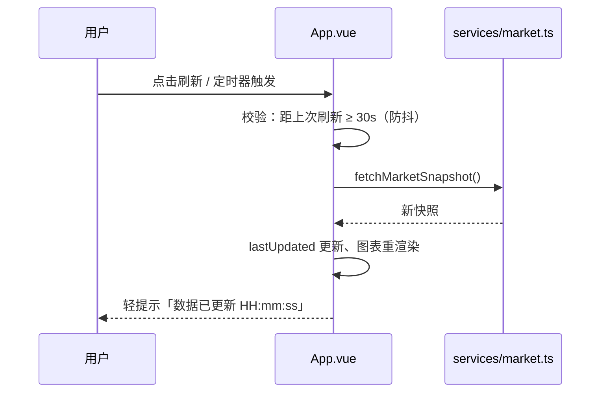

**自动刷新规则（规划）**
- 盘中：60s 轮询；
- 盘后：不轮询，展示收盘快照；
- 页面隐藏（`document.hidden`）：暂停轮询，回到前台立即刷新一次；
- 连续 3 次失败：停止轮询并提示，恢复手动刷新。

**数据源状态展示**
- 右上角徽标：`东方财富`（绿） / `Mock`（灰）；
- 页脚数据锚点：`数据锚点：2026/08/10 收盘后 · Mock 数据演示`；
- warnings 汇总：可点击展开失败域详情（规划）。

**验收要点**
1. 手动刷新有 30s 防抖；
2. 自动刷新频率符合交易时段规则；
3. 页面隐藏时暂停、可见时恢复。

---

## 9. 前端详细设计

### 9.1 目录结构（目标态）

```text
src/
├── main.ts / App.vue / styles.css / env.d.ts
├── router/index.ts                  # Vue Router（规划）
├── stores/                          # Pinia 状态（规划）
│   ├── market.ts                    # 快照/数据源/loading/轮询
│   └── watchlist.ts                 # 观察池 CRUD + 持久化
├── services/                        # 数据服务
│   ├── http.ts                      # fetch 封装：超时/重试/错误归一
│   ├── market.ts                    # 快照 + 脉冲
│   ├── stockSearch.ts               # 搜索
│   ├── watchlist.ts                 # 观察池（规划）
│   └── brief.ts                     # AI 简报（规划）
├── components/
│   ├── ChartPanel.vue / SectionHeader.vue
│   ├── PulseGauge.vue               # 脉冲仪表盘（拆分，规划）
│   ├── MetricGrid.vue               # 指标卡网格（拆分，规划）
│   ├── EmotionRadar.vue             # 情绪雷达（拆分，规划）
│   ├── SectorBar.vue / RotationMap.vue
│   ├── EtfTable.vue                 # ETF 表格（拆分，规划）
│   ├── WatchList.vue                # 观察池（拆分，规划）
│   └── AiBriefCard.vue              # 简报卡片（拆分，规划）
└── data/mock.ts                     # 类型契约 + Mock
```

### 9.2 组件树

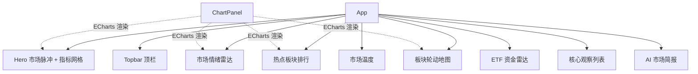

### 9.3 状态管理与数据流

- **现状**：组件内 `ref/computed`，`liveSnapshot` 为唯一数据源，派生数据全部 computed；
- **目标**：引入 Pinia `market` store，统一管理：`snapshot / dataSource / dataLoading / lastUpdated / refreshTimer / warnings`；
- **单向数据流**：`API → store → computed → 组件 → 图表`，禁止组件直接修改快照。

### 9.4 刷新与缓存（前端侧）

| 项 | 策略 |
| --- | --- |
| 快照缓存 | 内存级：30s 内重复请求直接复用 |
| 轮询 | 盘中 60s，隐藏页暂停 |
| 手动刷新 | 30s 防抖 |
| 图表更新 | `ChartPanel` 监听 option 变化 `setOption(notMerge:true)` |

### 9.5 视觉与响应式规范（已实现）

- 背景 `#F5F8FC`、主色科技蓝 `#1677FF`、红涨绿跌；
- 卡片化 + 圆角 + 高信息密度，Bloomberg/TradingView 风格；
- 断点：`1080px`（3 列指标卡）、`760px`（单列堆叠）、`390px`（紧凑）；
- 表格窄屏横向滚动（`.table-wrap { overflow-x: auto }`）；
- 字体/图标：系统字体栈 + Element Plus 图标 + ECharts。

---

## 10. 后端详细设计（规划）

### 10.1 FastAPI 服务结构

```text
backend/
├── app/
│   ├── main.py                  # 应用入口、路由挂载、CORS
│   ├── config.py                # 配置（数据源、缓存、调度）
│   ├── models/                  # SQLAlchemy 模型
│   ├── schemas/                 # Pydantic 契约（与前端类型对齐）
│   ├── routers/
│   │   ├── market.py            # 快照/脉冲
│   │   ├── sectors.py           # 板块榜/详情
│   │   ├── etfs.py              # ETF 榜/详情
│   │   ├── watchlist.py         # 观察池
│   │   └── brief.py             # AI 简报
│   ├── services/
│   │   ├── collector.py         # 数据采集（东财/腾讯）
│   │   ├── calculator.py        # 指标计算引擎（脉冲/情绪/板块/ETF）
│   │   ├── brief_engine.py      # 简报规则引擎
│   │   └── llm_client.py        # LLM 增强（可选）
│   └── jobs/scheduler.py        # 定时任务（收盘采集/计算/简报）
├── alembic/                     # 数据库迁移
└── tests/
```

### 10.2 PostgreSQL 核心表（草案）

```sql
-- 市场快照（每交易日/每 5min 一条）
CREATE TABLE market_snapshot (
  id BIGSERIAL PRIMARY KEY,
  trade_date DATE NOT NULL,
  ts TIMESTAMPTZ NOT NULL,
  pulse NUMERIC(5,2),             -- 市场脉冲指数
  emotion NUMERIC(5,2),           -- 情绪评分
  up_count INT, down_count INT, flat_count INT,
  limit_up INT, limit_down INT, broken_board INT,
  turnover_yi NUMERIC(12,2),      -- 两市成交额(亿)
  source TEXT DEFAULT 'eastmoney',
  UNIQUE (trade_date, ts)
);

-- 板块日快照
CREATE TABLE sector_snapshot (
  id BIGSERIAL PRIMARY KEY,
  trade_date DATE NOT NULL,
  code TEXT NOT NULL, name TEXT NOT NULL,
  change_pct NUMERIC(6,2), amount_yi NUMERIC(12,2),
  net_inflow_yi NUMERIC(12,2), limit_up_count INT,
  score NUMERIC(5,2), heat NUMERIC(5,2),
  UNIQUE (trade_date, code)
);

-- ETF 日快照
CREATE TABLE etf_snapshot (
  id BIGSERIAL PRIMARY KEY,
  trade_date DATE NOT NULL,
  code TEXT NOT NULL, name TEXT NOT NULL,
  price NUMERIC(10,4), change_pct NUMERIC(6,2),
  amount_yi NUMERIC(12,2), flow_yi NUMERIC(12,2),
  score NUMERIC(5,2), signal TEXT,
  UNIQUE (trade_date, code)
);

-- 用户观察池
CREATE TABLE watch_item (
  id BIGSERIAL PRIMARY KEY,
  user_id TEXT NOT NULL,           -- 规划鉴权
  code TEXT NOT NULL, name TEXT,
  type TEXT CHECK (type IN ('stock','etf','sector')),
  starred BOOLEAN DEFAULT true,
  created_at TIMESTAMPTZ DEFAULT now(),
  UNIQUE (user_id, code)
);

-- AI 简报
CREATE TABLE ai_brief (
  id BIGSERIAL PRIMARY KEY,
  trade_date DATE UNIQUE NOT NULL,
  status TEXT, summary TEXT, actions JSONB,
  risk_tips JSONB, confidence NUMERIC(5,2),
  engine TEXT,                     -- rule / llm
  created_at TIMESTAMPTZ DEFAULT now()
);
```

### 10.3 Redis 缓存键设计

| Key | Value | TTL |
| --- | --- | --- |
| `radar:snapshot:{yyyymmdd}` | 聚合快照 JSON | 30s（盘中）/ 5min（盘后） |
| `radar:pulse:{yyyymmdd}:{range}` | 脉冲序列 | 当日 |
| `radar:brief:{yyyymmdd}` | 简报 JSON | 长期 |
| `radar:upstream:quota` | 上游调用计数 | 1min（限流） |

### 10.4 定时任务

| 任务 | 触发 | 动作 |
| --- | --- | --- |
| 盘中采集 | 09:30-15:00 每 5min | 采集快照入库 |
| 收盘结算 | 15:10 | 计算日级指标、生成当日简报 |
| 数据校验 | 15:30 | 校验 up+down+flat、告警异常 |
| 缓存预热 | 09:15 | 预热指数/板块/ETF 快照 |

---

## 11. 错误处理与降级策略

### 11.1 异常分级

| 级别 | 场景 | 处理 |
| --- | --- | --- |
| L1 静默 | 单字段缺失、非关键图表无数据 | 显示「--」/ 空态，不打断 |
| L2 提示 | 某数据域失败（指数/板块/ETF） | warnings 记录 + 页脚/提示条展示 |
| L3 降级 | 上游全部不可用 | 整体回退 Mock + 数据源标识变更 |
| L4 阻断 | 页面 JS 异常、构建失败 | 错误边界组件 + 日志上报 |

### 11.2 数据源降级链

```text
东方财富 → 腾讯 → 缓存(Redis/函数内存) → Mock
```

- 代理层逐域降级：指数失败不影响板块；
- 前端 `fetchMarketSnapshot` 捕获异常后合并 Mock，保证渲染不中断；
- 所有降级均输出 `warnings[]`，UI 右上角数据源徽标实时反映。

### 11.3 UI 降级示例

| 场景 | 展示 |
| --- | --- |
| 板块接口失败 | 板块榜与轮动图使用 Mock 数据，标「演示数据」 |
| ETF 资金流缺失 | 资金流列显示「--」，信号按涨幅推断 |
| AI 简报失败 | 显示上次简报 + 重试按钮 |
| 搜索失败 | 空结果 + 提示 |

### 11.4 日志与监控

- 代理层：记录每次上游请求状态码/耗时/降级原因（Netlify Functions 日志）；
- 前端：`warnings` 聚合展示，规划接入错误上报（Sentry）；
- 后端：请求日志 + 指标计算告警（up+down+flat 校验）。

---

## 12. 非功能需求

| 类别 | 要求 |
| --- | --- |
| 性能 | 首屏 < 3s；快照接口 P95 < 2s；图表渲染 < 500ms |
| 可用性 | 数据源降级不影响页面可用；核心操作反馈 < 200ms |
| 兼容性 | Chrome/Edge/Safari 最新两版；移动端适配（≤390px） |
| 安全 | 前端不存储任何账号密钥；后端接口限流；CORS 白名单 |
| 可维护性 | 类型契约集中（mock.ts）；组件单一职责；指标公式配置化 |
| 合规 | 免责声明常驻；AI 简报禁止投资建议表述；数据仅供研究参考 |
| 数据质量 | 涨跌家数校验、字段缺失告警、成交额单位统一（亿） |

---

## 13. 开发任务拆分与里程碑

### 13.1 里程碑

| 阶段 | 范围 | 状态 |
| --- | --- | --- |
| MVP1a | 首页 Dashboard + Mock 数据（PRD 第 9 章） | ✅ 已完成 |
| MVP1b | 东方财富真实数据接入（指数/广度/板块/ETF）+ 降级 | ✅ 已完成 |
| MVP1c | 搜索接入 + 组件拆分 + 自动刷新 + 观察池持久化 | 🔄 进行中 |
| MVP2 | FastAPI 后端 + PostgreSQL + Redis + 指标计算引擎 + AI 简报 | ⏳ 规划 |
| V2 | 龙虎榜 / 主力资金追踪 / 个股AI诊断 / 板块生命周期 | ⏳ 规划 |
| V3 | 策略配置 / 自动提醒 / ETF轮动策略 / AI量化助手 | ⏳ 规划 |

### 13.2 任务清单（MVP1c 增量）

| # | 任务 | 涉及文件 | 验收 |
| --- | --- | --- | --- |
| 1 | 组件拆分：PulseGauge/MetricGrid/EmotionRadar/SectorBar/RotationMap/EtfTable/WatchList/AiBriefCard | `src/components/*` | 功能与现状一致 |
| 2 | 引入 Pinia，快照/数据源/loading 入 store | `src/stores/market.ts` | 状态单一来源 |
| 3 | 自动刷新：盘中 60s 轮询、隐藏暂停、连续失败停止 | `src/stores/market.ts` | 符合 8.11 规则 |
| 4 | 观察池 localStorage 持久化 + 管理抽屉 | `src/stores/watchlist.ts` + 组件 | 星标刷新保留 |
| 5 | 搜索 UI 集成（下拉候选、类型标识、点击跳转） | `App.vue` + `stockSearch.ts` | 符合 8.10 |
| 6 | 市场温度补充涨停/跌停/炸板率字段与展示 | `mock.ts` + `netlify/functions/market-snapshot.mjs` | 字段齐全 |
| 7 | 板块强度评分与 ETF 评分计算（前端/代理层） | `market-snapshot.mjs` + `mock.ts` | 公式符合第 7 章 |
| 8 | 路由与个股追踪占位页 | `src/router/` | `/stock/:code` 可达 |

### 13.3 后端任务清单（MVP2）

| # | 任务 | 验收 |
| --- | --- | --- |
| 1 | FastAPI 骨架 + CORS + 健康检查 | `/api/v1/health` 200 |
| 2 | 采集服务（东财/腾讯）+ 字段归一化 | 与 5.2 映射一致 |
| 3 | 指标计算引擎（脉冲/温度/情绪/板块/ETF） | 与第 7 章公式一致、可复算 |
| 4 | PostgreSQL 表结构与迁移（10.2） | 建表成功 |
| 5 | Redis 缓存 + 限流（10.3） | 缓存命中率 > 80% |
| 6 | 聚合接口（6.4） | 前端切换后端无感 |
| 7 | AI 简报规则引擎 + 合规过滤 | 四要素齐全、无违禁词 |
| 8 | 定时任务（10.4） | 收盘自动生成简报 |

---

## 14. 后续迭代规划

### V2
- 龙虎榜分析：席位、机构净买、游资动向；
- 主力资金追踪：个股/板块主力净流入时序；
- 个股 AI 诊断：多因子诊断卡（趋势/资金/情绪/风险）；
- 板块生命周期：导入期/主升/分歧/退潮标签；
- ETF 明细页：份额变化、溢价率、成分股。

### V3
- 用户策略配置：自定权重与阈值，生成个人化雷达；
- 自动提醒：涨跌幅/资金异动/炸板预警（推送）；
- ETF 轮动策略：动量轮动信号；
- AI 量化助手：自然语言问答市场数据。

---

## 15. 附录

### A. 东财接口字段速查

| 字段 | 含义 | 单位/格式 |
| --- | --- | --- |
| f2 | 最新价 | 元（fltt=2 保留小数） |
| f3 | 涨跌幅 | % |
| f4 | 涨跌额 | 元 |
| f5 | 成交量 | 手 |
| f6 | 成交额 | 元 |
| f12 | 代码 | 字符串 |
| f14 | 名称 | 字符串 |
| f62 | 主力净流入 | 元 |
| f104/f105/f106 | 涨/跌/平家数 | 整数 |

### B. 指标计算示例（市场脉冲）

```text
输入：上涨 2517 / 总 5481 → 广度 45.9 分（标准化后）
     涨停 68 家 → 强度 62 分
     主力净流入 +120 亿 → 资金 55 分
     成交 1.18 万亿 / 5日均 1.10 万亿 → 活跃 58 分
     热点集中度 72.4 → 热点 61 分
     指数振幅 1.8%（反向）→ 波动 66 分
脉冲 = 45.9×0.25 + 62×0.20 + 55×0.20 + 58×0.15 + 61×0.10 + 66×0.10
     = 11.5 + 12.4 + 11.0 + 8.7 + 6.1 + 6.6 = 56.3 → 震荡
```

### C. 合规提示文案

- 页脚：`仅供研究参考，不构成投资建议`；
- AI 简报禁用词：买入、卖出、目标价、预测、必涨、稳赚；
- 数据源标注：公开接口数据可能延迟/缺失，以交易所为准。

---

